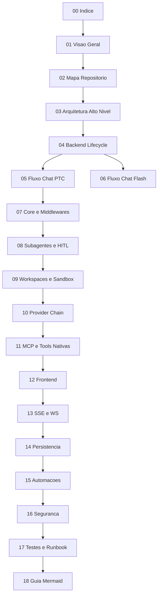

# 00 - Indice da Arquitetura v2

## Objetivo do documento
Organizar a leitura da arquitetura do LangAlpha para dois objetivos ao mesmo tempo: replicar o projeto localmente e entender em profundidade como cada camada funciona.

## Componentes e responsabilidades
- `arquitetura_projeto/00-04`: base conceitual, mapa de repositorio, arquitetura macro e ciclo do backend.
- `arquitetura_projeto/05-09`: fluxos de execucao do agente, subagentes, sessao e sandbox.
- `arquitetura_projeto/10-13`: dados financeiros, MCP/tools, frontend e protocolos em tempo real.
- `arquitetura_projeto/14-17`: persistencia, automacoes, seguranca e runbook de testes/operacao.
- `arquitetura_projeto/18`: convencoes Mermaid para garantir diagramas reproduziveis.
- `estudo/`: trilha pratica guiada + referencia para aprendizado continuo.

## Fluxo principal

## Contratos e interfaces
| Bloco | Documento principal | Documento pratico correspondente em `estudo/` |
|---|---|---|
| Backend lifecycle | `04_backend_fastapi_lifecycle.md` | `05_lab_primeiro_fluxo_e2e.md` |
| Chat PTC/Flash | `05_fluxo_chat_ptc.md` / `06_fluxo_chat_flash.md` | `06_lab_ptc_deep_research.md` / `07_lab_flash_orquestracao.md` |
| SSE/WS | `13_protocolos_tempo_real.md` | `08_lab_sse_reconnect_replay_interrupt.md` / `09_lab_ws_market_data_cache.md` |
| Sandbox/Vault | `09_workspaces_sandbox_sessoes.md` | `11_lab_workspaces_sandbox_vault.md` |
| Automacoes | `15_automacoes_e_execucao_assincrona.md` | `12_lab_automacoes_cron_price_trigger.md` |
| Persistencia | `14_banco_migracoes_persistencia.md` | `13_lab_persistencia_checkpointer_store.md` |

## Pontos de observabilidade
- Verificar startup global via `/health` e logs de `setup.py`.
- Para fluxos de chat, observar status de thread (`/api/v1/threads/{id}/status`).
- Para WS market data, validar endpoint de status (`/ws/v1/market-data/status`).

## Falhas comuns e comportamento esperado
- Falha: pular docs de base e ir direto para lab avancado.
  Comportamento esperado: seguir ordem do indice e usar links bidirecionais com `estudo/`.
- Falha: tratar todo diagrama Mermaid como equivalente em qualquer viewer.
  Comportamento esperado: aplicar regras do `18_guia_mermaid_funcional.md`.

## Como replicar este bloco
1. Ler `01`, `03`, `04` para fixar a arquitetura macro.
2. Executar a trilha de `estudo/00` ate `estudo/05` para validar primeira execucao ponta a ponta.
3. Voltar para docs 05-17 conforme area de interesse (chat, dados, persistencia, seguranca).

## Checklist de validacao
- [ ] Todos os docs `00-18` existem em `arquitetura_projeto/`.
- [ ] Pasta `estudo/` existe e esta vinculada neste indice.
- [ ] Existem links bidirecionais entre conceito (arquitetura) e pratica (estudo).
- [ ] Ordem de leitura esta clara para iniciacao e aprofundamento.

## Referencia cruzada
- [01_visao_geral_produto.md](./01_visao_geral_produto.md)
- [03_arquitetura_alto_nivel.md](./03_arquitetura_alto_nivel.md)
- [18_guia_mermaid_funcional.md](./18_guia_mermaid_funcional.md)
- [../estudo/00_indice_estudo.md](../estudo/00_indice_estudo.md)

## Lista completa
1. [00_indice.md](./00_indice.md)
2. [01_visao_geral_produto.md](./01_visao_geral_produto.md)
3. [02_mapa_repositorio.md](./02_mapa_repositorio.md)
4. [03_arquitetura_alto_nivel.md](./03_arquitetura_alto_nivel.md)
5. [04_backend_fastapi_lifecycle.md](./04_backend_fastapi_lifecycle.md)
6. [05_fluxo_chat_ptc.md](./05_fluxo_chat_ptc.md)
7. [06_fluxo_chat_flash.md](./06_fluxo_chat_flash.md)
8. [07_agente_ptc_core_middlewares.md](./07_agente_ptc_core_middlewares.md)
9. [08_subagentes_plan_mode_hitl.md](./08_subagentes_plan_mode_hitl.md)
10. [09_workspaces_sandbox_sessoes.md](./09_workspaces_sandbox_sessoes.md)
11. [10_dados_financeiros_provider_chain.md](./10_dados_financeiros_provider_chain.md)
12. [11_mcp_servers_e_tools_nativos.md](./11_mcp_servers_e_tools_nativos.md)
13. [12_frontend_arquitetura.md](./12_frontend_arquitetura.md)
14. [13_protocolos_tempo_real.md](./13_protocolos_tempo_real.md)
15. [14_banco_migracoes_persistencia.md](./14_banco_migracoes_persistencia.md)
16. [15_automacoes_e_execucao_assincrona.md](./15_automacoes_e_execucao_assincrona.md)
17. [16_autenticacao_seguranca_chaves.md](./16_autenticacao_seguranca_chaves.md)
18. [17_testes_operacao_runbook.md](./17_testes_operacao_runbook.md)
19. [18_guia_mermaid_funcional.md](./18_guia_mermaid_funcional.md)
