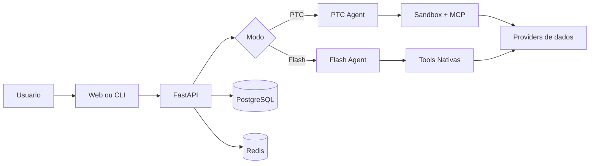

# 01 - Visao Geral do Produto

## Objetivo do documento
Apresentar o LangAlpha como plataforma de pesquisa financeira orientada a agente, destacando os modos PTC e Flash e o que muda entre eles em arquitetura, latencia e capacidade de execucao.

## Componentes e responsabilidades
- Frontend Web (`web/`): experiencia de chat, dashboard, market view e automacoes.
- Backend FastAPI (`src/server/`): API REST, streaming SSE, WS proxy, auth e persistencia.
- Agent Core (`src/ptc_agent/`): construcao de agentes, middlewares, tools e subagentes.
- Dados (`src/data_client/`, `mcp_servers/`, `src/tools/`): fallback de provedores e processamento.
- Infra (`docker-compose.yml`, `config.yaml`, `agent_config.yaml`): runtime, recursos e politicas de execucao.

## Fluxo principal

## Contratos e interfaces
| Dimensao | PTC | Flash |
|---|---|---|
| Execucao de codigo | Sim (`execute_code`) | Nao |
| MCP toolset | Sim | Nao |
| Setup de sessao | Workspace + sandbox | Workspace flash compartilhado |
| Melhor para | Pesquisa profunda, artefatos, analise multi-etapa | Lookup rapido, triagem, orquestracao leve |
| Custo de latencia inicial | Maior | Menor |

Interfaces expostas para clientes:
- REST: `/api/v1/*`
- SSE: `/api/v1/threads/*`
- WS market data: `/ws/v1/market-data/*`

## Pontos de observabilidade
- No backend: logs `PTC_CHAT` vs `FLASH_CHAT` para diferenciar trilha.
- No frontend: status de conexao do chat e watch de thread.
- No banco: correlacao por `thread_id` em tabelas de conversa.

## Falhas comuns e comportamento esperado
- Falha: usar Flash para workload que precisa analise em lote e graficos derivados de codigo.
  Comportamento esperado: encaminhar para PTC.
- Falha: achar que PTC e apenas "mais lento" sem beneficio.
  Comportamento esperado: reconhecer ganho de capacidade analitica e persistencia de contexto.

## Como replicar este bloco
1. Rodar modo Flash em pergunta curta para medir tempo de resposta.
2. Rodar modo PTC com tarefa de analise mais longa e comparar eventos.
3. Observar diferenca de ferramentas chamadas em cada modo.

## Checklist de validacao
- [ ] Diferencas PTC x Flash estao claras para escolha de modo.
- [ ] Interfaces de acesso (REST/SSE/WS) foram identificadas.
- [ ] Foi executada ao menos uma chamada real em cada modo.

## Referencia cruzada
- [05_fluxo_chat_ptc.md](./05_fluxo_chat_ptc.md)
- [06_fluxo_chat_flash.md](./06_fluxo_chat_flash.md)
- [12_frontend_arquitetura.md](./12_frontend_arquitetura.md)
- [../estudo/05_lab_primeiro_fluxo_e2e.md](../estudo/05_lab_primeiro_fluxo_e2e.md)
