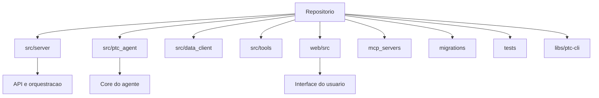

# 02 - Mapa do Repositorio

## Objetivo do documento
Mapear a estrutura do repositorio para orientar manutencao, contribuicao de codigo e estudo dirigido por camadas.

## Componentes e responsabilidades
- `src/server/`: routers, handlers, services, models, auth, database.
- `src/ptc_agent/`: agent factory, middlewares, prompts, tools e sandbox core.
- `src/data_client/`: orquestracao de provedores de mercado/noticias/fundamentos.
- `src/tools/`: tools de dominio expostas aos agentes.
- `web/src/`: app React com paginas de produto e utilitarios de integracao.
- `mcp_servers/`: servidores MCP conectados via stdio.
- `migrations/`: esquema DB e evolucao via Alembic.
- `tests/`: unitarios, integracao, sandbox contract.
- `libs/ptc-cli/`: cliente terminal para o ecossistema.

## Fluxo principal

## Contratos e interfaces
| Fronteira | Interface predominante | Regra de ownership |
|---|---|---|
| `web/src` -> `src/server` | HTTP REST + SSE + WS | UI nao deve duplicar regra de negocio de backend |
| `src/server` -> `src/ptc_agent` | chamada interna Python | Backend orquestra, agent executa |
| `src/tools` -> `src/data_client` | adapters internos | Tools sem credencial hardcoded |
| `src/ptc_agent` -> `mcp_servers` | MCP stdio | Contrato de tool versionado em config |

## Pontos de observabilidade
- `git status` para verificar escopo de mudanca por camada.
- `rg --files` para localizar rapidamente area de impacto.
- `tests/unit` vs `tests/integration` para validar fronteiras alteradas.

## Falhas comuns e comportamento esperado
- Falha: mudar contrato HTTP sem alinhar consumidores frontend.
  Comportamento esperado: validar impacto em `web/src/pages/*/utils/api.ts`.
- Falha: colocar logica de roteamento de provider na UI.
  Comportamento esperado: manter decisao em `src/data_client`.

## Como replicar este bloco
1. Executar `find src web tests -maxdepth 2 -type d | sort`.
2. Identificar em qual camada cada problema real do projeto pertence.
3. Mapear um fluxo real da UI ate o service backend correspondente.

## Checklist de validacao
- [ ] Cada pasta principal tem responsabilidade definida.
- [ ] Fronteiras de contrato foram entendidas.
- [ ] Foi feito mapeamento de pelo menos um fluxo completo no codigo.

## Referencia cruzada
- [03_arquitetura_alto_nivel.md](./03_arquitetura_alto_nivel.md)
- [12_frontend_arquitetura.md](./12_frontend_arquitetura.md)
- [17_testes_operacao_runbook.md](./17_testes_operacao_runbook.md)
- [../estudo/15_mapa_contribuicao_codigo.md](../estudo/15_mapa_contribuicao_codigo.md)
