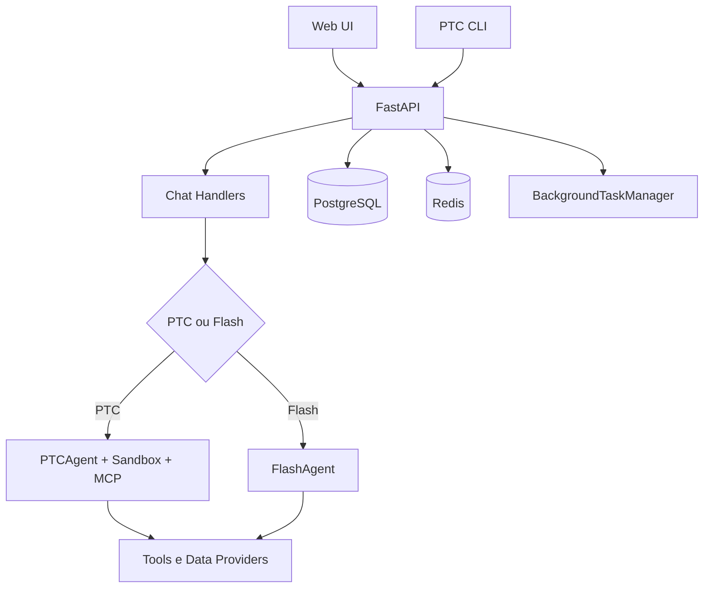
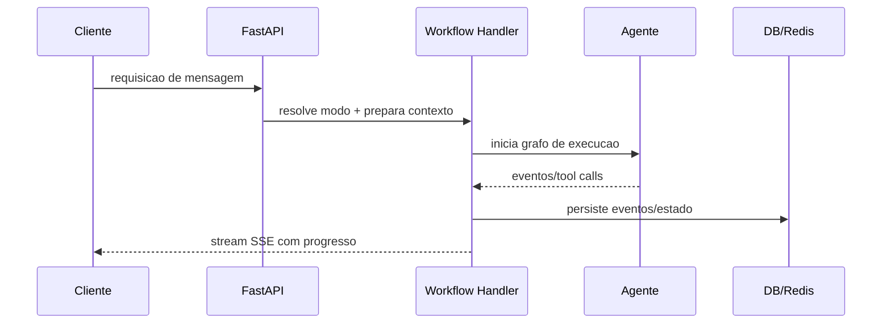

# 03 - Arquitetura Alto Nivel

## Objetivo do documento
Mostrar a topologia completa do sistema (clientes, backend, agente, dados, persistencia e runtime) e como isso suporta workloads longos com reconexao.

## Componentes e responsabilidades
- Clientes: Web React e PTC CLI.
- API Core: FastAPI com routers por dominio.
- Execucao de workflow: handlers PTC/Flash + BackgroundTaskManager.
- Persistencia: PostgreSQL (app + checkpointer/store) e Redis (cache/eventos).
- Runtime de analise: sandbox (Daytona/Docker) e MCP.
- Integracoes: provedores de dados financeiros e servicos de busca/fetch.

## Fluxo principal
### Visao macro

### Sequencia operacional resumida

## Contratos e interfaces
| Interface | Endpoint/canal | Finalidade |
|---|---|---|
| REST app | `/api/v1/*` | CRUD e operacoes sincronas |
| SSE workflow | `/api/v1/threads/*` | resposta incremental + reconexao |
| WS market | `/ws/v1/market-data/*` | feed de mercado em tempo real |
| DB app | tabelas `conversation_*`, `workspaces`, etc. | estado de negocio |
| DB graph | tabelas checkpointer/store | estado de execucao LangGraph |

## Pontos de observabilidade
- Saude macro: `/health`, logs de startup e shutdown.
- Saude de workflow: status por thread + contagem de eventos.
- Saude de dados de mercado: status WS + fallback para REST.

## Falhas comuns e comportamento esperado
- Falha: acoplar requisicao HTTP ao ciclo de vida completo do workflow.
  Comportamento esperado: workflow segue em background com replay/reconnect.
- Falha: confundir armazenamento de negocio com armazenamento de checkpoint.
  Comportamento esperado: separar leitura de tabelas app e tabelas LangGraph.

## Como replicar este bloco
1. Subir stack local e validar `/health`.
2. Abrir chat e iniciar uma mensagem longa.
3. Fechar cliente e reconectar para verificar continuidade por SSE.

## Checklist de validacao
- [ ] Topologia cliente -> API -> agente -> dados -> persistencia foi compreendida.
- [ ] Fluxo com reconexao foi observado na pratica.
- [ ] Diferenca entre persistencia de app e de checkpoint foi validada.

## Referencia cruzada
- [04_backend_fastapi_lifecycle.md](./04_backend_fastapi_lifecycle.md)
- [05_fluxo_chat_ptc.md](./05_fluxo_chat_ptc.md)
- [13_protocolos_tempo_real.md](./13_protocolos_tempo_real.md)
- [../estudo/05_lab_primeiro_fluxo_e2e.md](../estudo/05_lab_primeiro_fluxo_e2e.md)
