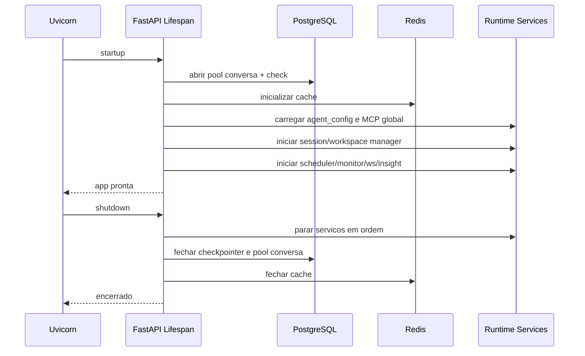
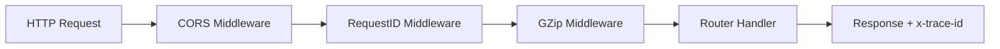

# 04 - Backend FastAPI Lifecycle

## Objetivo do documento
Detalhar o ciclo de vida do backend desde boot ate shutdown, com foco em ordem de inicializacao, componentes globais e degradacao controlada.

## Componentes e responsabilidades
- `server.py`: entrada uvicorn e parametros de runtime.
- `src/server/app/setup.py`: `lifespan`, middlewares e routers.
- Recursos globais: `agent_config`, `session_service`, `workspace_manager`, `checkpointer`, `store`, `llm_service`.
- Servicos de fundo: cleanup manager, scheduler, monitor de preco, insight service, ws manager.

## Fluxo principal
### Startup/Shutdown

### Ordem de middlewares HTTP

## Contratos e interfaces
Routers incluidos na aplicacao:
- Threads, Sessions, Workspaces, Workspace Files, Workspace Sandbox
- Market Data, Users, Watchlist, Portfolio, News, Calendar
- API Keys, Automations, Insights, OAuth, Public, Skills, Vault, Memo, Memory
- Health e Preview Redirect
- WS market data (condicional)

Regras de inicializacao:
- Falhas criticas de DB devem abortar startup.
- Falhas nao criticas (ex.: cache opcional) degradam funcionalidade com warning.

## Pontos de observabilidade
- `x-trace-id` por request para correlacao ponta a ponta.
- Logs de startup com status de cada modulo.
- Endpoint `/health` para liveness basico.

## Falhas comuns e comportamento esperado
- Falha: interpretar warning de servico opcional como indisponibilidade total.
  Comportamento esperado: identificar se o modulo esta degradado ou bloqueante.
- Falha: shutdown abrupto com tarefas pendentes.
  Comportamento esperado: usar sequencia de encerramento e timeouts configurados.

## Como replicar este bloco
1. Iniciar backend e revisar logs de startup.
2. Chamar `/health` e rotas basicas (`/api/v1/workspaces`, `/api/v1/threads`).
3. Encerrar processo e confirmar logs de shutdown ordenado.

## Checklist de validacao
- [ ] Ordem de startup/shutdown esta clara.
- [ ] Routers principais foram identificados.
- [ ] Foi validado `x-trace-id` em resposta HTTP.

## Referencia cruzada
- [03_arquitetura_alto_nivel.md](./03_arquitetura_alto_nivel.md)
- [05_fluxo_chat_ptc.md](./05_fluxo_chat_ptc.md)
- [15_automacoes_e_execucao_assincrona.md](./15_automacoes_e_execucao_assincrona.md)
- [../estudo/14_lab_testes_debug_observabilidade.md](../estudo/14_lab_testes_debug_observabilidade.md)
