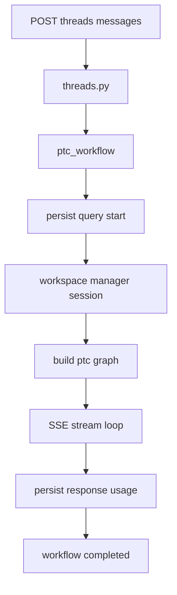
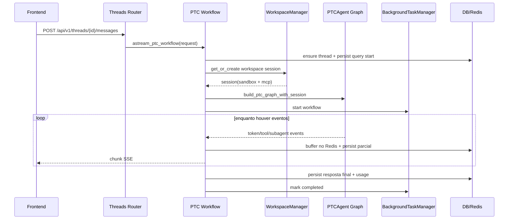

# 05 - Fluxo Completo do Chat PTC

## Objetivo do documento
Explicar o fluxo completo de uma mensagem PTC: entrada da API, persistencia inicial, provisionamento de sessao/sandbox, execucao do grafo, stream SSE e finalizacao.

## Componentes e responsabilidades
- `src/server/app/threads.py`: roteia envio de mensagens para modo PTC.
- `src/server/handlers/chat/ptc_workflow.py`: pipeline principal de streaming.
- `src/server/services/workspace_manager.py`: garante sessao valida por workspace.
- `src/ptc_agent/agent/graph.py`: constroi grafo LangGraph por sessao.
- `src/server/services/background_task_manager.py`: resiliencia de workflow desconectado.
- `src/server/services/persistence/conversation.py`: grava query, response, token/tool usage.

## Fluxo principal
### Macro

### Sequencia detalhada

## Contratos e interfaces
Endpoints principais do fluxo:
- `POST /api/v1/threads/messages`
- `POST /api/v1/threads/{thread_id}/messages`
- `GET /api/v1/threads/{thread_id}/messages/stream`
- `GET /api/v1/threads/{thread_id}/messages/replay`
- `POST /api/v1/threads/{thread_id}/interrupt`
- `POST /api/v1/threads/{thread_id}/cancel`

Metadados de controle relevantes:
- `thread_id`, `workspace_id`, `query_type`, `checkpoint_id`, `hitl_response`.
- `additional_context` (skills, anexos, widget context, directives).

## Pontos de observabilidade
- Logs de `PTC_CHAT` com tempos de fase e status de persistencia.
- Chaves Redis de evento por workflow e status de reconexao.
- Endpoint `GET /api/v1/threads/{thread_id}/status` para estado corrente.

## Falhas comuns e comportamento esperado
- Falha: cliente desconecta durante execucao longa.
  Comportamento esperado: workflow continua em background e pode ser reconectado.
- Falha: sessao de workspace invalida/obsoleta.
  Comportamento esperado: manager recria sessao e religa sandbox.
- Falha: replay sem cursor coerente.
  Comportamento esperado: backend entrega historico possivel e anexa stream vivo.

## Como replicar este bloco
1. Criar workspace e enviar pergunta que acione tools multiplas.
2. Durante a resposta, interromper conexao do cliente.
3. Reconectar usando `/messages/stream` e validar continuidade.
4. Conferir status da thread e persistencia final.

## Checklist de validacao
- [ ] Fluxo PTC da entrada ate persistencia final foi observado.
- [ ] Reconexao SSE funcionou sem perda funcional.
- [ ] Eventos de tool/subagente apareceram durante stream.

## Referencia cruzada
- [04_backend_fastapi_lifecycle.md](./04_backend_fastapi_lifecycle.md)
- [07_agente_ptc_core_middlewares.md](./07_agente_ptc_core_middlewares.md)
- [13_protocolos_tempo_real.md](./13_protocolos_tempo_real.md)
- [../estudo/06_lab_ptc_deep_research.md](../estudo/06_lab_ptc_deep_research.md)
