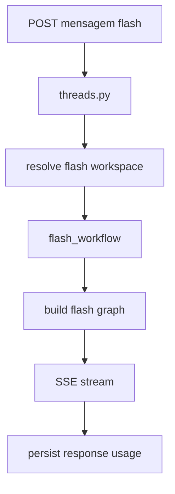
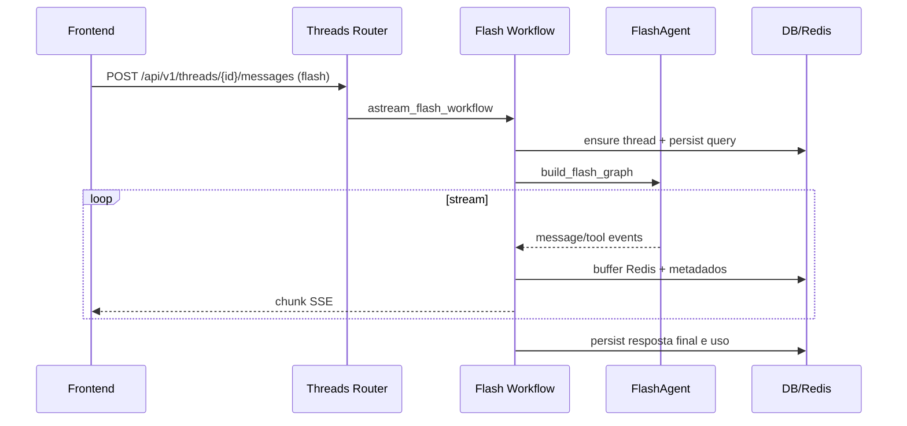

# 06 - Fluxo Completo do Chat Flash

## Objetivo do documento
Documentar o fluxo Flash com foco em baixa latencia, sem sandbox/MCP, e comparar operacionalmente com PTC para decisao correta de modo.

## Componentes e responsabilidades
- `src/server/app/threads.py`: detecta `agent_mode=flash`.
- `src/server/handlers/chat/flash_workflow.py`: pipeline streaming de baixa sobrecarga.
- `src/ptc_agent/agent/flash/agent.py`: construtor do FlashAgent e toolset leve.
- `src/server/database/workspace.py`: resolve workspace flash compartilhado por usuario.
- `src/server/services/background_task_manager.py`: suporte a reconnect/replay.

## Fluxo principal
### Macro

### Sequencia detalhada

## Contratos e interfaces
| Item | Flash |
|---|---|
| Workspace | pode ser resolvido automaticamente (`/workspaces/flash`) |
| Sandbox | nao utilizado |
| MCP | nao utilizado |
| Tools tipicas | web search, market data nativa, sec filings, secretary |
| Endpoint de envio | igual ao PTC, com `agent_mode=flash` |

Endpoints relevantes:
- `POST /api/v1/threads/messages`
- `POST /api/v1/threads/{thread_id}/messages`
- `GET /api/v1/threads/{thread_id}/messages/stream`

## Pontos de observabilidade
- Logs de `FLASH_CHAT` e tempos de resposta curtos.
- Quantidade de tool calls e tipo de ferramenta acionada.
- Indicadores de fallback de modelo quando configurado.

## Falhas comuns e comportamento esperado
- Falha: usar Flash para analise que precisa codigo e MCP.
  Comportamento esperado: redirecionar para PTC.
- Falha: inferir que Flash nao persiste dados de conversa.
  Comportamento esperado: persistencia ocorre normalmente em tabelas de conversa.

## Como replicar este bloco
1. Enviar consulta curta em Flash (ex.: overview de ticker).
2. Validar resposta rapida e eventos SSE.
3. Comparar tempo e tipos de tools com uma execucao PTC equivalente.

## Checklist de validacao
- [ ] Modo Flash executou sem depender de sandbox.
- [ ] Eventos SSE foram recebidos do inicio ao fim.
- [ ] Diferencas praticas para PTC ficaram claras.

## Referencia cruzada
- [05_fluxo_chat_ptc.md](./05_fluxo_chat_ptc.md)
- [07_agente_ptc_core_middlewares.md](./07_agente_ptc_core_middlewares.md)
- [13_protocolos_tempo_real.md](./13_protocolos_tempo_real.md)
- [../estudo/07_lab_flash_orquestracao.md](../estudo/07_lab_flash_orquestracao.md)
