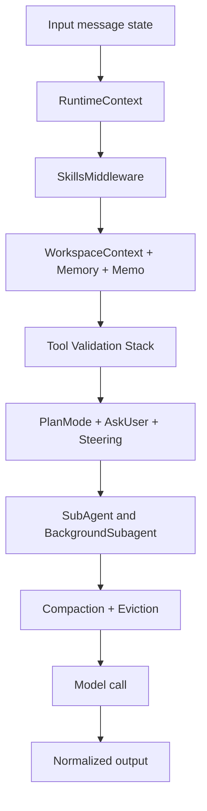
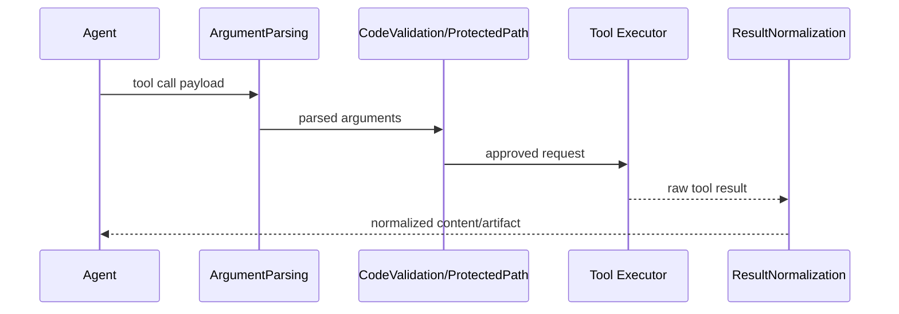

# 07 - Agente PTC Core e Middlewares

## Objetivo do documento
Descrever como o PTCAgent e montado (tools + prompts + middlewares), e como cada camada influencia seguranca, qualidade de resposta e performance.

## Componentes e responsabilidades
- `src/ptc_agent/agent/agent.py`: fabrica principal do PTCAgent.
- `src/ptc_agent/agent/prompts/`: montagem do system prompt.
- `src/ptc_agent/agent/tools/`: toolset interno (bash, execute_code, filesystem, todo).
- `src/ptc_agent/agent/middleware/`: pipeline de transformacao/controle.
- `src/ptc_agent/core/mcp_registry.py`: descoberta, conexao e freeze de MCP tools.

## Fluxo principal
### Pipeline de middleware

### Sequencia de tool call segura

## Contratos e interfaces
Grupos de middleware mais importantes:
- Contexto: `RuntimeContext`, `WorkspaceContext`, `MemoryContext`, `MemoAwareness`.
- Ferramenta segura: `ToolArgumentParsing`, `CodeValidation`, `ProtectedPath`, `LeakDetection`.
- Conversacao: `Steering`, `SubagentSteering`, `PlanMode`, `AskUser`.
- Operacao: `Compaction`, `LargeResultEviction`, `TodoWrite`, `FileOperation`.

Contrato do `execute_code`:
- Entrada: codigo Python a executar no sandbox.
- Saida: resultado textual + artefatos (quando aplicavel).
- Uso esperado: processamento de dados de alto volume fora da janela LLM.

## Pontos de observabilidade
- Logs por middleware para diagnosticar falhas de tool call.
- Metricas de compaction (gatilho e reducao de contexto).
- Telemetria de subagentes (spawn, progresso, finalizacao).

## Falhas comuns e comportamento esperado
- Falha: depurar erro de tool sem considerar ordem de middleware.
  Comportamento esperado: analisar pipeline de parsing -> validacao -> execucao -> normalizacao.
- Falha: pular compaction tuning em conversas longas.
  Comportamento esperado: ajustar limites no `agent_config.yaml`.

## Como replicar este bloco
1. Rodar tarefa que acione `execute_code` e filesystem no mesmo turno.
2. Forcar entrada invalida para observar middleware de validacao.
3. Inspecionar logs para identificar middleware responsavel por cada transformacao.

## Checklist de validacao
- [ ] Pipeline de middlewares foi entendido por funcao.
- [ ] Tool call segura foi observada com sucesso e com erro controlado.
- [ ] Relacao entre middleware e qualidade final da resposta ficou clara.

## Referencia cruzada
- [05_fluxo_chat_ptc.md](./05_fluxo_chat_ptc.md)
- [08_subagentes_plan_mode_hitl.md](./08_subagentes_plan_mode_hitl.md)
- [11_mcp_servers_e_tools_nativos.md](./11_mcp_servers_e_tools_nativos.md)
- [../estudo/10_lab_tools_nativos_vs_mcp.md](../estudo/10_lab_tools_nativos_vs_mcp.md)
