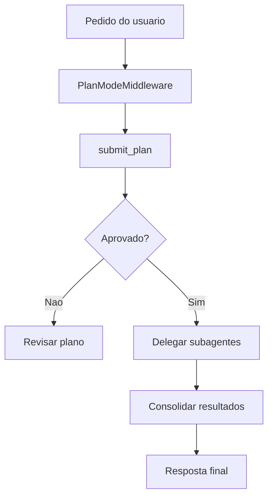
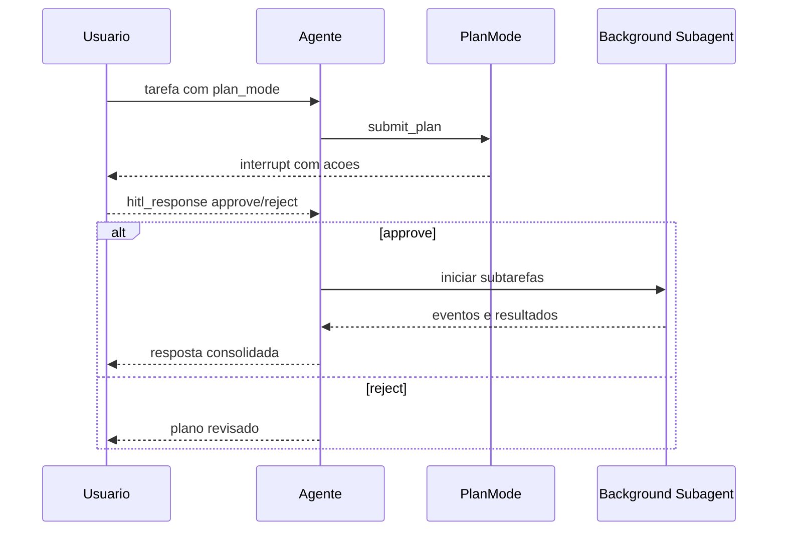

# 08 - Subagentes, Plan Mode e HITL

## Objetivo do documento
Mostrar como o sistema estrutura delegacao para subagentes, como plan mode trava execucao mutante ate aprovacao humana e como funciona o ciclo de interrupt/resume.

## Componentes e responsabilidades
- `SubAgentMiddleware`: delegacao local e controle de subtarefas.
- `BackgroundSubagentMiddleware`: execucao paralela e registry de tarefas.
- `BackgroundSubagentOrchestrator`: unifica agente principal + tarefas de fundo.
- `PlanModeMiddleware`: obriga `submit_plan` antes de executar mudancas.
- `AskUserMiddleware` e modelo HITL: coleta/aplica decisoes do usuario.

## Fluxo principal
### Fluxo de aprovacao e delegacao

### Sequencia interrupt/resume

## Contratos e interfaces
Contrato HITL (`ChatRequest.hitl_response`):
- Estrutura: mapa de `interrupt_id` -> `HITLResponse`.
- Decisoes aceitas: `approve` ou `reject`.
- Mensagem de rejeicao e persistida para novo ciclo de planejamento.

Endpoints de subagente:
- `GET /api/v1/threads/{thread_id}/tasks/{task_id}`
- `POST /api/v1/threads/{thread_id}/tasks/{task_id}/messages`

## Pontos de observabilidade
- Eventos de interrupt/resume por thread.
- Estado de tarefas de subagente no registry.
- Tempo de coleta de subtarefas apos fim do turno principal.

## Falhas comuns e comportamento esperado
- Falha: tratar rejeicao como erro terminal.
  Comportamento esperado: gerar nova versao do plano com feedback aplicado.
- Falha: delegacao sem fronteira de ownership.
  Comportamento esperado: subtarefas com escopo claro para evitar conflito.

## Como replicar este bloco
1. Enviar tarefa com `plan_mode=true`.
2. Rejeitar primeira proposta e aprovar segunda.
3. Acompanhar tarefas de subagente e mensagens de progresso.

## Checklist de validacao
- [ ] Fluxo HITL approve/reject foi exercitado.
- [ ] Foi observada criacao e acompanhamento de pelo menos uma subtask.
- [ ] Resumo final consolidou saidas de subagentes.

## Referencia cruzada
- [05_fluxo_chat_ptc.md](./05_fluxo_chat_ptc.md)
- [07_agente_ptc_core_middlewares.md](./07_agente_ptc_core_middlewares.md)
- [13_protocolos_tempo_real.md](./13_protocolos_tempo_real.md)
- [../estudo/08_lab_sse_reconnect_replay_interrupt.md](../estudo/08_lab_sse_reconnect_replay_interrupt.md)
