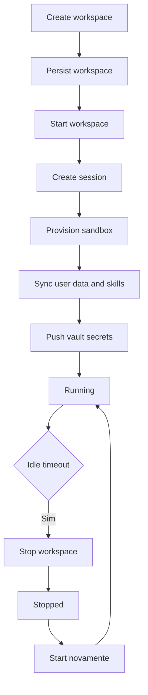
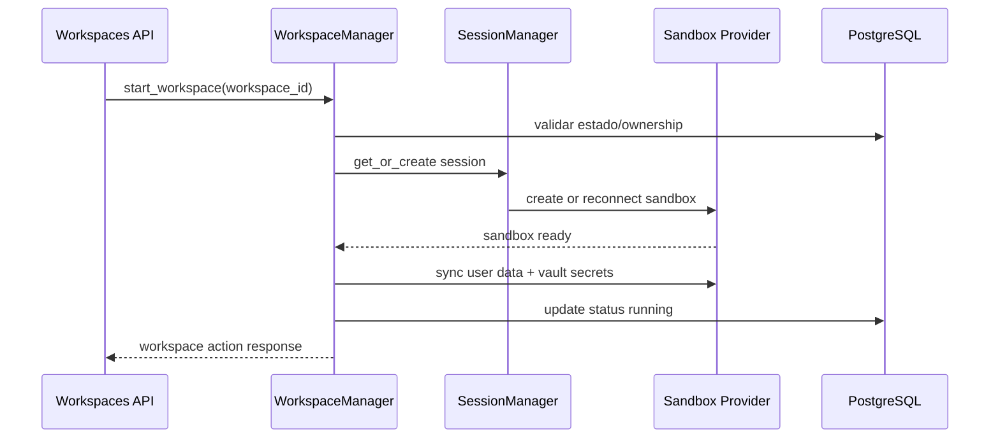

# 09 - Workspaces, Sandbox e Sessoes

## Objetivo do documento
Detalhar ciclo de vida de workspace e sessao (criacao, start, stop, refresh, archive), incluindo sincronizacao de dados do usuario e segredos de vault.

## Componentes e responsabilidades
- `WorkspaceManager`: estado de workspace e sessao em memoria + DB.
- `SessionManager`: manutencao de sessoes e cleanup por idle.
- `PTCSandbox`: encapsula provedor Daytona/Docker.
- `workspaces router`: endpoints de CRUD e acoes operacionais.
- `vault router`: segredos por workspace para tools/runtime.

## Fluxo principal
### Ciclo de vida de workspace

### Sequencia de start operacional

## Contratos e interfaces
Endpoints principais:
- `POST /api/v1/workspaces`
- `GET /api/v1/workspaces`
- `GET /api/v1/workspaces/{workspace_id}`
- `POST /api/v1/workspaces/{workspace_id}/start`
- `POST /api/v1/workspaces/{workspace_id}/stop`
- `POST /api/v1/workspaces/{workspace_id}/refresh`
- `POST /api/v1/workspaces/{workspace_id}/archive`
- `DELETE /api/v1/workspaces/{workspace_id}`

Estados comuns: `creating`, `running`, `stopped`, `error`, `flash`.

## Pontos de observabilidade
- Logs de transicao de status de workspace.
- Medicao de tempo de provisionamento e reconnect de sandbox.
- Alertas de falha de sync de dados e push de vault.

## Falhas comuns e comportamento esperado
- Falha: corrida de start/stop simultaneo no mesmo workspace.
  Comportamento esperado: lock por workspace e serializacao.
- Falha: sessao antiga presa em cache.
  Comportamento esperado: invalidar sessao e reconstruir runtime.

## Como replicar este bloco
1. Criar workspace e iniciar.
2. Executar stop e start novamente.
3. Atualizar segredo de vault e confirmar push no sandbox.

## Checklist de validacao
- [ ] Transicoes de estado foram executadas sem inconsistencias.
- [ ] Sessao e sandbox reconectaram apos restart.
- [ ] Segredo atualizado foi disponibilizado no runtime.

## Referencia cruzada
- [05_fluxo_chat_ptc.md](./05_fluxo_chat_ptc.md)
- [14_banco_migracoes_persistencia.md](./14_banco_migracoes_persistencia.md)
- [16_autenticacao_seguranca_chaves.md](./16_autenticacao_seguranca_chaves.md)
- [../estudo/11_lab_workspaces_sandbox_vault.md](../estudo/11_lab_workspaces_sandbox_vault.md)
