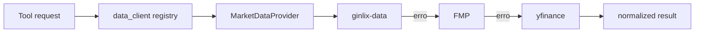

# 10 - Dados Financeiros e Provider Chain

## Objetivo do documento
Explicar como a camada de dados seleciona provedores, aplica fallback e entrega dados consistentes para tools nativas e fluxos PTC.

## Componentes e responsabilidades
- `src/data_client/registry.py`: instancia providers com verificacao de disponibilidade.
- `src/data_client/market_data_provider.py`: chain por mercado/simbolo.
- `src/data_client/news_data_provider.py`: fallback sequencial de noticias.
- `src/data_client/financial_data_provider.py`: composicao de financial + market intel.
- backends: ginlix-data, FMP, yfinance.

## Fluxo principal

## Contratos e interfaces
| Contrato | Fonte de configuracao | Efeito |
|---|---|---|
| Ordem de providers de mercado | `config.yaml -> market_data.providers` | define cadeia de fallback |
| Ordem de providers de noticia | `config.yaml -> news_data.providers` | define tentativa sequencial |
| Disponibilidade por credencial/env | runtime env vars + import checks | remove provider indisponivel da cadeia |

Interfaces principais de acesso:
- `get_intraday`, `get_daily`, `get_snapshots`, `get_market_status`.
- fallback orientado por regiao de simbolo quando aplicavel.

## Pontos de observabilidade
- Logs de fallback por provider (`market_data.fallback`).
- Origem do dado retornado (source name) para auditoria.
- Taxa de truncamento/limite quando provider possui restricao.

## Falhas comuns e comportamento esperado
- Falha: assumir que todos os providers retornam mesmo schema e granularidade.
  Comportamento esperado: normalizacao na camada data_client e validacao em tool.
- Falha: ignorar ausencia de credencial e esperar full coverage.
  Comportamento esperado: degradacao para provider disponivel.

## Como replicar este bloco
1. Rodar requests para ticker liquido em diferentes intervalos.
2. Desabilitar temporariamente provider superior e observar fallback.
3. Comparar consistencia de campos essenciais no retorno.

## Checklist de validacao
- [ ] Cadeia de fallback foi observada em execucao.
- [ ] Fonte do provider foi identificada nos logs/resultados.
- [ ] Normalizacao de dados foi validada nas tools consumidoras.

## Referencia cruzada
- [11_mcp_servers_e_tools_nativos.md](./11_mcp_servers_e_tools_nativos.md)
- [12_frontend_arquitetura.md](./12_frontend_arquitetura.md)
- [../estudo/10_lab_tools_nativos_vs_mcp.md](../estudo/10_lab_tools_nativos_vs_mcp.md)
