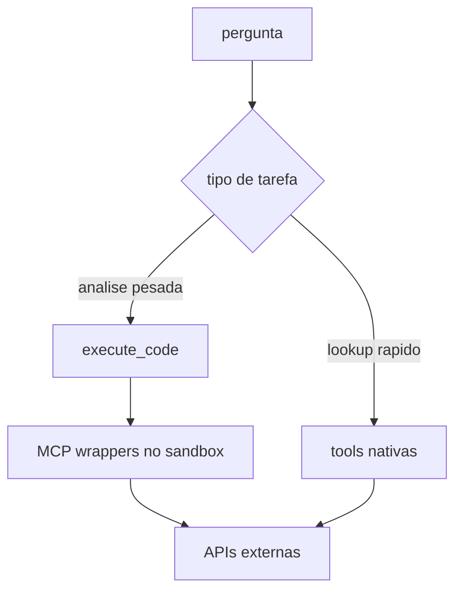

# 11 - MCP Servers e Tools Nativas

## Objetivo do documento
Definir quando usar tools nativas vs MCP, com inventario de servidores MCP e padrao de uso para analise reproduzivel.

## Componentes e responsabilidades
MCP servers atuais (exemplos centrais):
- `price_data`, `fundamentals`, `macro`, `options`, `x_api`, `yf_*`.

Tools nativas relevantes:
- market data overview/screener/indices,
- web search + fetch,
- sec filings,
- secretary tools,
- toolset interno do agente (`execute_code`, filesystem, bash, show_widget).

## Fluxo principal

## Contratos e interfaces
| Cenario | Recomendacao |
|---|---|
| resposta curta e imediata | tools nativas |
| serie temporal longa / transformacao / modelagem | execute_code + MCP |
| fonte exige token por workspace | vault + MCP/tool integrado |

Config de MCP em `agent_config.yaml`:
- `mcp.servers[]`: nome, comando, args, env, exposicao de tools.
- `tool_exposure_mode`: `summary`/`detailed`.

## Pontos de observabilidade
- Logs de inicializacao e freeze do MCP registry.
- Erros de subprocesso MCP (stdio) por server.
- Telemetria de uso de `execute_code` por tipo de tarefa.

## Falhas comuns e comportamento esperado
- Falha: usar MCP para pergunta simples.
  Comportamento esperado: reduzir custo usando tool nativa.
- Falha: usar tool nativa para dataset volumoso sem processamento local.
  Comportamento esperado: migrar para PTC `execute_code`.

## Como replicar este bloco
1. Executar uma pergunta curta com tool nativa.
2. Executar uma analise de serie longa com `execute_code` e MCP.
3. Comparar tempo, custo de contexto e qualidade do output.

## Checklist de validacao
- [ ] Diferenca de papel entre nativa e MCP ficou objetiva.
- [ ] Pelo menos um caso de cada trilha foi testado.
- [ ] Config MCP foi localizada e compreendida.

## Referencia cruzada
- [07_agente_ptc_core_middlewares.md](./07_agente_ptc_core_middlewares.md)
- [10_dados_financeiros_provider_chain.md](./10_dados_financeiros_provider_chain.md)
- [../estudo/10_lab_tools_nativos_vs_mcp.md](../estudo/10_lab_tools_nativos_vs_mcp.md)
