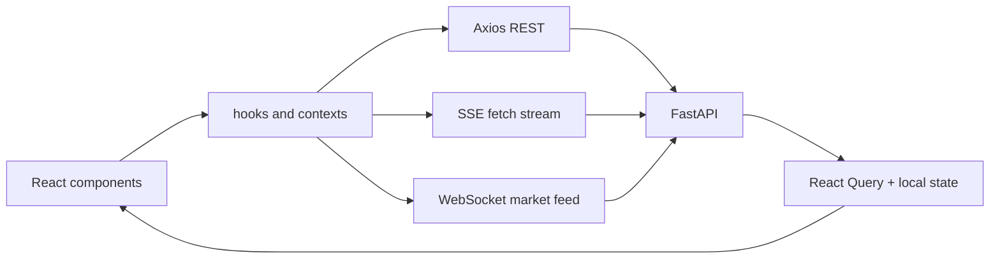

# 12 - Arquitetura Frontend

## Objetivo do documento
Mapear a arquitetura React do produto, com foco em rotas, providers globais, estado remoto/local e integracao com REST/SSE/WS.

## Componentes e responsabilidades
- Boot da app: `main.tsx` com providers de query/theme/auth/router.
- Shell e rotas: `App.tsx` e `components/Main/Main.tsx`.
- Dominios de pagina:
  - `pages/ChatAgent`
  - `pages/Dashboard`
  - `pages/MarketView`
  - `pages/Automations`
- Integracao backend:
  - `api/client.ts` (axios)
  - utilitarios SSE do ChatAgent
  - hooks WS do MarketView

## Fluxo principal

## Contratos e interfaces
Rotas de usuario autenticado:
- `/dashboard`, `/chat/*`, `/market`, `/automations`, `/settings`.

Contratos de dados:
- REST para CRUD/consulta.
- SSE para workflow de chat e replay.
- WS para agregados de mercado em tempo real.

Regra de estado:
- Dados remotos devem preferir React Query.
- Estado de streaming pode usar estado local coordenado por utilitarios.

## Pontos de observabilidade
- Devtools de React Query para cache e invalidacao.
- Logs de stream/reconnect no chat.
- Indicador de status WS no MarketView.

## Falhas comuns e comportamento esperado
- Falha: concorrencia entre estado local e cache remoto gerando UI inconsistente.
  Comportamento esperado: definir fonte de verdade por tipo de dado.
- Falha: nao tratar fallback quando WS indisponivel.
  Comportamento esperado: degradar para REST intraday.

## Como replicar este bloco
1. Navegar entre Dashboard, Chat, Market e Automations.
2. Acionar chamadas REST e fluxos SSE.
3. Simular queda WS e validar comportamento de fallback.

## Checklist de validacao
- [ ] Rotas principais e providers globais foram compreendidos.
- [ ] Integracoes REST/SSE/WS foram exercitadas.
- [ ] Foi validado comportamento de fallback no frontend.

## Referencia cruzada
- [05_fluxo_chat_ptc.md](./05_fluxo_chat_ptc.md)
- [13_protocolos_tempo_real.md](./13_protocolos_tempo_real.md)
- [../estudo/09_lab_ws_market_data_cache.md](../estudo/09_lab_ws_market_data_cache.md)
