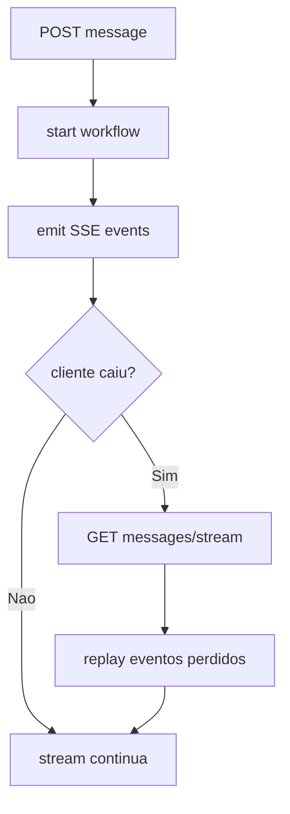
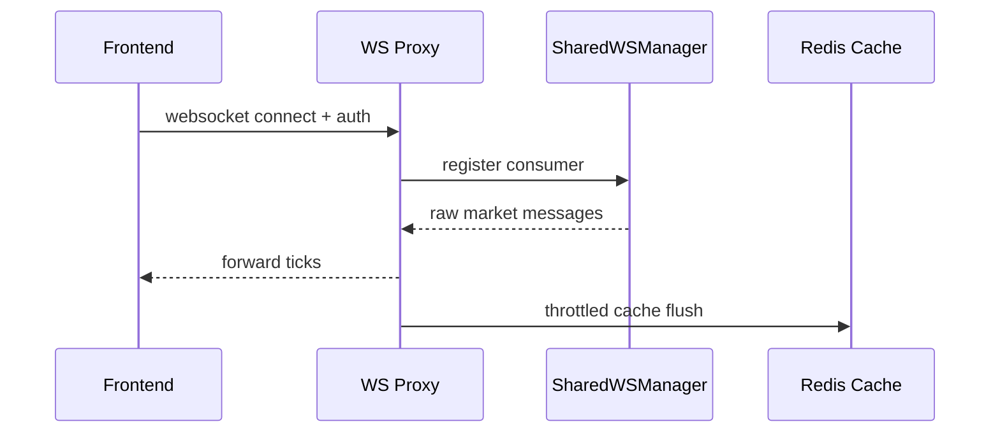

# 13 - Protocolos em Tempo Real (SSE e WS)

## Objetivo do documento
Documentar os contratos de tempo real do projeto: SSE para workflows de agente e WS para dados de mercado, incluindo replay e reconexao.

## Componentes e responsabilidades
- SSE:
  - rotas de threads (`messages`, `messages/stream`, `messages/replay`, `watch`)
  - `BackgroundTaskManager` + `WorkflowTracker`
  - buffer de eventos no Redis
- WS:
  - `market_data_ws.py`
  - `SharedWSConnectionManager`
  - sincronizacao de tick no cache intraday

## Fluxo principal
### Fluxo SSE com reconnect

### Sequencia WS market data

## Contratos e interfaces
Endpoints SSE centrais:
- `POST /api/v1/threads/messages`
- `POST /api/v1/threads/{thread_id}/messages`
- `GET /api/v1/threads/{thread_id}/messages/stream`
- `GET /api/v1/threads/{thread_id}/messages/replay`
- `GET /api/v1/threads/{thread_id}/watch`

Endpoints WS centrais:
- `GET /ws/v1/market-data/status`
- `WS /ws/v1/market-data/aggregates/{market}`

Garantias esperadas:
- Workflow nao depende da conexao SSE ativa para finalizar.
- Reconexao deve permitir recuperar progresso recente.

## Pontos de observabilidade
- Taxa de reconnect e volume de replay por thread.
- Latencia media de envio de eventos SSE.
- Estado de conexao WS e taxa de flush no cache intraday.

## Falhas comuns e comportamento esperado
- Falha: cliente interpreta fechamento SSE como falha terminal.
  Comportamento esperado: acionar reconnect e replay.
- Falha: excesso de escrita por tick no Redis.
  Comportamento esperado: throttle + merge incremental de barras.

## Como replicar este bloco
1. Iniciar workflow longo e acompanhar SSE.
2. Cortar rede/aba e reconectar stream.
3. Conectar WS market data e confirmar atualizacao de cache.

## Checklist de validacao
- [ ] Reconnect SSE funcionou com replay.
- [ ] Workflow concluiu mesmo com desconexao do cliente.
- [ ] WS proxy autenticou e transmitiu ticks corretamente.

## Referencia cruzada
- [05_fluxo_chat_ptc.md](./05_fluxo_chat_ptc.md)
- [06_fluxo_chat_flash.md](./06_fluxo_chat_flash.md)
- [12_frontend_arquitetura.md](./12_frontend_arquitetura.md)
- [../estudo/08_lab_sse_reconnect_replay_interrupt.md](../estudo/08_lab_sse_reconnect_replay_interrupt.md)
