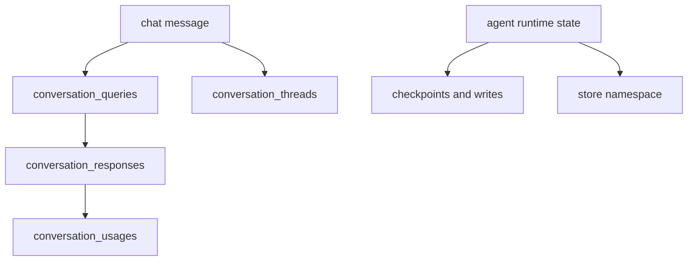

# 14 - Banco, Migracoes e Persistencia

## Objetivo do documento
Consolidar a arquitetura de dados: tabelas de negocio, tabelas de estado LangGraph, conexoes/pools e pipeline de persistencia do chat.

## Componentes e responsabilidades
- Alembic: `migrations/versions/*`.
- DB app: `src/server/database/*`.
- Persistencia de conversa: `src/server/services/persistence/conversation.py`.
- Checkpointer/store: `src/server/utils/checkpointer.py`.

## Fluxo principal

## Contratos e interfaces
Tabelas de negocio mais usadas:
- `users`, `workspaces`, `workspace_files`
- `conversation_threads`, `conversation_queries`, `conversation_responses`, `conversation_usages`, `conversation_feedback`
- `automations`, `automation_executions`, `market_insights`

Tabelas de estado de execucao:
- `checkpoint_*` e `store*`

Regras de pool:
- pool de conversa e checkpointer inicializados no startup e fechados no shutdown.

## Pontos de observabilidade
- Health query `SELECT 1` em pools no boot.
- Tempo de persistencia por turno.
- Erros de transacao/estado de conexao nao-idle no teardown.

## Falhas comuns e comportamento esperado
- Falha: migracao nao aplicada apos update de codigo.
  Comportamento esperado: executar `alembic upgrade head` antes de subir fluxo completo.
- Falha: leitura de estado de chat em tabela de checkpoint.
  Comportamento esperado: separar consulta de negocio e de runtime.

## Como replicar este bloco
1. Rodar migracoes.
2. Executar conversa com ao menos dois turnos.
3. Inspecionar tabelas de conversa e tabelas checkpoint/store.

## Checklist de validacao
- [ ] Migracoes foram aplicadas com sucesso.
- [ ] Registros de query/response/usage foram persistidos.
- [ ] Estado LangGraph foi gravado em checkpoint/store.

## Referencia cruzada
- [04_backend_fastapi_lifecycle.md](./04_backend_fastapi_lifecycle.md)
- [05_fluxo_chat_ptc.md](./05_fluxo_chat_ptc.md)
- [17_testes_operacao_runbook.md](./17_testes_operacao_runbook.md)
- [../estudo/13_lab_persistencia_checkpointer_store.md](../estudo/13_lab_persistencia_checkpointer_store.md)
