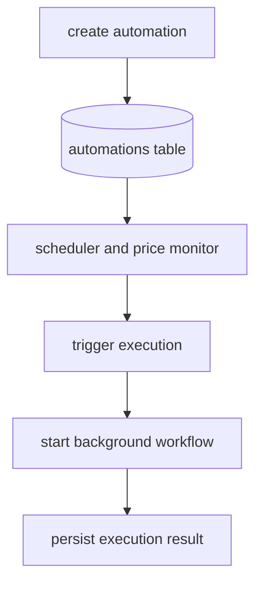
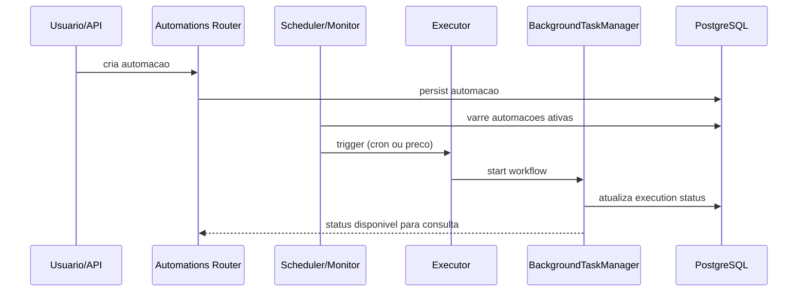

# 15 - Automacoes e Execucao Assincrona

## Objetivo do documento
Explicar como automacoes sao agendadas/disparadas e como workflows longos executam desacoplados da conexao HTTP.

## Componentes e responsabilidades
- `automations router`: CRUD, pause/resume/trigger e historico de execucoes.
- `AutomationScheduler`: gatilhos por horario/cron.
- `PriceMonitorService`: gatilhos por condicao de preco.
- `AutomationExecutor`: instancia workflow para automacao.
- `BackgroundTaskManager`: controla ciclo de vida assincromo.
- `WorkflowTracker`: status consultavel de execucao.

## Fluxo principal
### Macro

### Sequencia operacional

## Contratos e interfaces
Endpoints de automacao:
- `POST /api/v1/automations`
- `GET /api/v1/automations`
- `GET /api/v1/automations/{automation_id}`
- `PATCH /api/v1/automations/{automation_id}`
- `DELETE /api/v1/automations/{automation_id}`
- `POST /api/v1/automations/{automation_id}/trigger`
- `POST /api/v1/automations/{automation_id}/pause`
- `POST /api/v1/automations/{automation_id}/resume`
- `GET /api/v1/automations/{automation_id}/executions`

Parametros chave de runtime assincromo:
- limites de concorrencia,
- TTL de eventos,
- timeout de abandonado,
- janela de shutdown gracioso.

## Pontos de observabilidade
- Status de execucao por thread/automation.
- Contagem de workflows rodando e fila ativa.
- Falhas de trigger por credencial/dado de mercado.

## Falhas comuns e comportamento esperado
- Falha: automacao ativa sem credenciais necessarias para tarefa.
  Comportamento esperado: registrar falha de execucao com motivo claro.
- Falha: concorrencia acima da capacidade de runtime.
  Comportamento esperado: respeitar limite e enfileirar/rejeitar conforme politica.

## Como replicar este bloco
1. Criar automacao cron simples.
2. Disparar manualmente via endpoint trigger.
3. Validar historico de execucao e status final.

## Checklist de validacao
- [ ] Ciclo create -> trigger -> execution -> history foi validado.
- [ ] Ao menos uma execucao assincroma foi observada no tracker.
- [ ] Configuracoes de concorrencia/timeout foram identificadas.

## Referencia cruzada
- [13_protocolos_tempo_real.md](./13_protocolos_tempo_real.md)
- [14_banco_migracoes_persistencia.md](./14_banco_migracoes_persistencia.md)
- [17_testes_operacao_runbook.md](./17_testes_operacao_runbook.md)
- [../estudo/12_lab_automacoes_cron_price_trigger.md](../estudo/12_lab_automacoes_cron_price_trigger.md)
