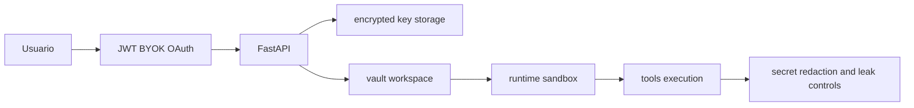

# 16 - Autenticacao, Seguranca e Chaves

## Objetivo do documento
Descrever os mecanismos de autenticacao/autorizacao, protecao de credenciais, vault por workspace e hardening de runtime.

## Componentes e responsabilidades
- `src/config/env.py`: `HOST_MODE` e variaveis de ambiente.
- `src/server/auth/*`: auth JWT para HTTP e WS.
- `api_keys` e servicos OAuth: BYOK/OAuth para modelos.
- `database/encryption.py`: cifragem de chaves sensiveis em repouso.
- `app/vault.py`: segredos por workspace.
- Middlewares de seguranca no agente: path protection, leak detection, etc.

## Fluxo principal

## Contratos e interfaces
| Contexto | Regra |
|---|---|
| `HOST_MODE=oss` | auth simplificada para uso self-host/local |
| `HOST_MODE=platform` | auth e limites de uso habilitados |
| BYOK/OAuth | chaves/tokens de usuario cifrados no DB |
| Vault workspace | segredo isolado por workspace e push no sandbox |

Endpoints relacionados:
- `/api/v1/users/me/api-keys*`
- `/api/v1/oauth/*`
- `/api/v1/workspaces/{workspace_id}/vault/*`

## Pontos de observabilidade
- Logs de falha de autenticacao HTTP/WS.
- Eventos de atualizacao de chave/token (sem vazar segredo).
- Alertas de leak detection e path protection no agente.

## Falhas comuns e comportamento esperado
- Falha: usar chave de encriptacao default em ambiente compartilhado.
  Comportamento esperado: chave unica e rotacao controlada.
- Falha: segredo global para todos workspaces em cenario multi-tenant.
  Comportamento esperado: segredo segregado por workspace.

## Como replicar este bloco
1. Configurar modo de auth local (`oss`) e validar acesso basico.
2. Configurar BYOK/OAuth e testar resolucao de modelo.
3. Registrar segredo no vault do workspace e usar em ferramenta dependente.

## Checklist de validacao
- [ ] Fluxo de auth HTTP e WS foi validado.
- [ ] Armazenamento cifrado de credencial foi confirmado no fluxo.
- [ ] Segredo por workspace foi aplicado com sucesso no runtime.

## Referencia cruzada
- [09_workspaces_sandbox_sessoes.md](./09_workspaces_sandbox_sessoes.md)
- [11_mcp_servers_e_tools_nativos.md](./11_mcp_servers_e_tools_nativos.md)
- [../estudo/11_lab_workspaces_sandbox_vault.md](../estudo/11_lab_workspaces_sandbox_vault.md)
