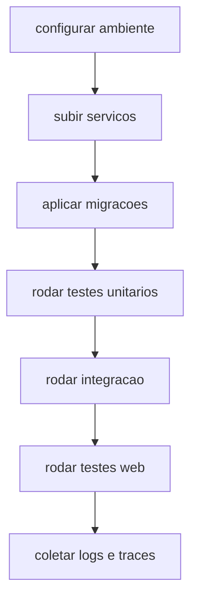

# 17 - Testes, Operacao e Runbook

## Objetivo do documento
Fornecer um runbook pratico para validar stack local, executar testes relevantes e depurar regressao com foco em fluxo real do produto.

## Componentes e responsabilidades
- `Makefile`: comandos padrao de setup, execucao e testes.
- `tests/unit/*`: verificacao isolada de modulos.
- `tests/integration/*`: verificacao de integracao de API e persistencia.
- `tests/integration/sandbox/*`: contrato de sandbox/provider.
- `web` tests: vitest/e2e para camada de UI.

## Fluxo principal

## Contratos e interfaces
Comandos operacionais mais usados:
- `make up`
- `make dev` / `make dev-web`
- `make migrate`
- `make test`
- `make test-web`
- `make test-sandbox PROVIDER=...`
- `make lint`

Marcadores de teste backend:
- `integration`, `slow`, `provider_docker`, `provider_daytona`.

## Pontos de observabilidade
- Logs de backend por modulo.
- Status de thread/workflow durante testes de chat.
- Health de DB/Redis e conexao WS para cenarios de mercado.

## Falhas comuns e comportamento esperado
- Falha: executar integracao sem infra pronta.
  Comportamento esperado: subir DB/Redis e aplicar migracoes antes.
- Falha: misturar falha de credencial com falha de logica.
  Comportamento esperado: separar smoke local (free mode) de full mode.

## Como replicar este bloco
1. Seguir runbook de setup e subir stack.
2. Executar suites em ordem: unit -> integration -> web.
3. Registrar evidencias (logs, status endpoints, resultados de teste).

## Checklist de validacao
- [ ] Stack local sobe sem erro critico.
- [ ] Testes unitarios e de integracao rodaram com resultado esperado.
- [ ] Fluxos de observabilidade foram usados para diagnostico.

## Referencia cruzada
- [04_backend_fastapi_lifecycle.md](./04_backend_fastapi_lifecycle.md)
- [13_protocolos_tempo_real.md](./13_protocolos_tempo_real.md)
- [14_banco_migracoes_persistencia.md](./14_banco_migracoes_persistencia.md)
- [../estudo/14_lab_testes_debug_observabilidade.md](../estudo/14_lab_testes_debug_observabilidade.md)
