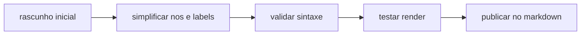

# 18 - Guia Mermaid Funcional

## Objetivo do documento
Padronizar o uso de Mermaid para gerar diagramas legiveis e renderizaveis em viewers comuns (GitHub, IDEs e plataformas com suporte parcial).

## Componentes e responsabilidades
- Tipo de diagrama recomendado: `flowchart` e `sequenceDiagram` como base.
- Convencoes de nomeacao: IDs simples (`A`, `B`, `Svc1`) e labels curtos.
- Convencoes de densidade: separar macro e detalhe em blocos distintos.

## Fluxo principal

## Contratos e interfaces
Regras de compatibilidade:
1. Priorizar `flowchart` e `sequenceDiagram`.
2. Evitar labels com excesso de simbolos especiais.
3. Evitar um unico grafo gigante; quebrar em macro + detalhe.
4. Usar blocos de codigo exclusivos por diagrama.
5. Manter setas e orientacao consistentes (`LR` ou `TD`).

Arquivos criticos que devem ter 2 diagramas:
- `03`, `04`, `05`, `06`, `07`, `08`, `09`, `13`, `15`.

## Pontos de observabilidade
- Verificar render no visualizador principal do repositorio.
- Em caso de falha de render, reduzir complexidade do bloco e retestar.
- Revisar diff para garantir que mudancas de diagrama nao quebraram links/secoes.

## Falhas comuns e comportamento esperado
- Falha: diagrama muito denso com muitos cruzamentos.
  Comportamento esperado: quebrar em 2 diagramas complementares.
- Falha: uso de sintaxe avancada em viewer limitado.
  Comportamento esperado: fallback para sintaxe base.

## Como replicar este bloco
1. Criar diagrama macro (`flowchart`).
2. Criar diagrama detalhe (`sequenceDiagram`) se arquivo for critico.
3. Validar render antes de finalizar doc.

## Checklist de validacao
- [ ] Todo arquivo tem ao menos 1 Mermaid.
- [ ] Arquivos criticos tem 2 Mermaid.
- [ ] Diagramas usam sintaxe base com labels simples.
- [ ] Nenhum bloco de Mermaid esta quebrando render.

## Referencia cruzada
- [00_indice.md](./00_indice.md)
- [03_arquitetura_alto_nivel.md](./03_arquitetura_alto_nivel.md)
- [13_protocolos_tempo_real.md](./13_protocolos_tempo_real.md)
- [../estudo/17_referencias_internas_do_repo.md](../estudo/17_referencias_internas_do_repo.md)
